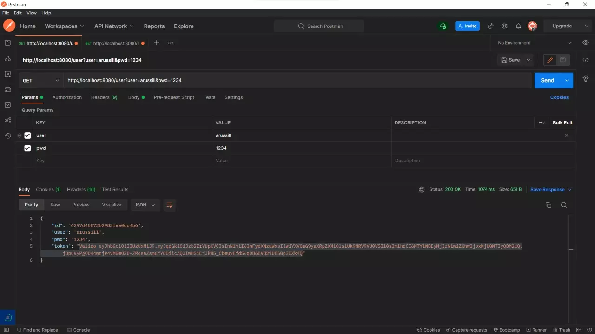
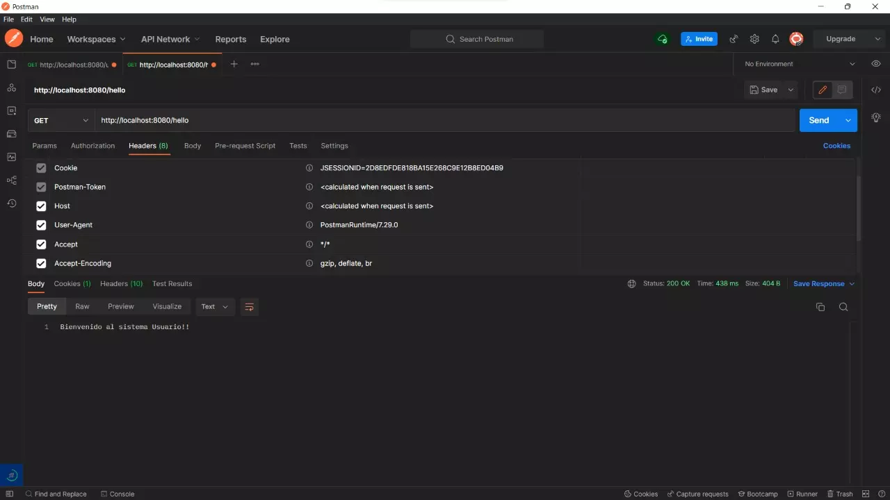
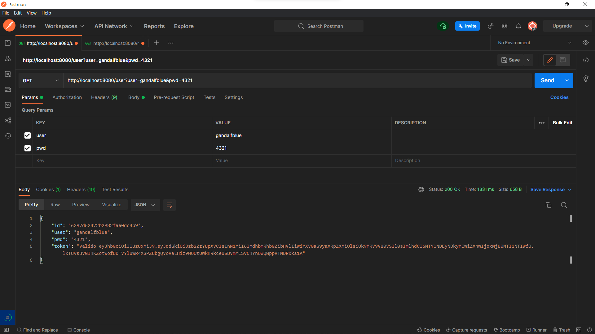
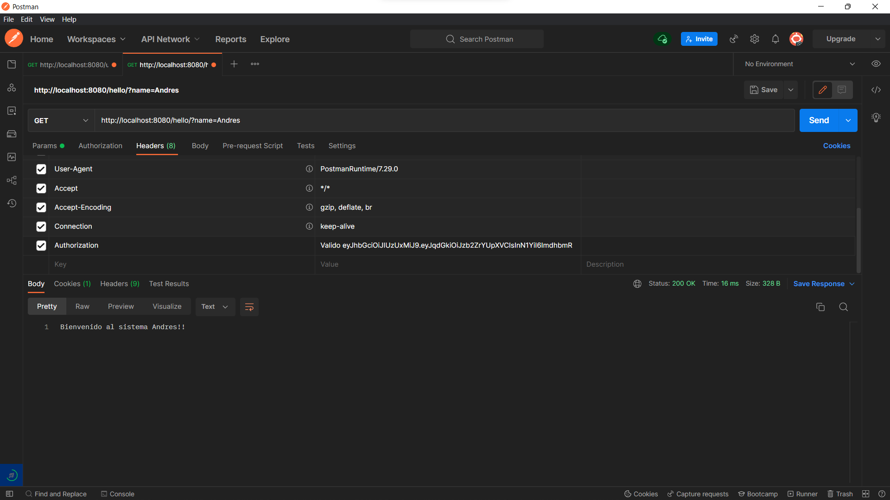
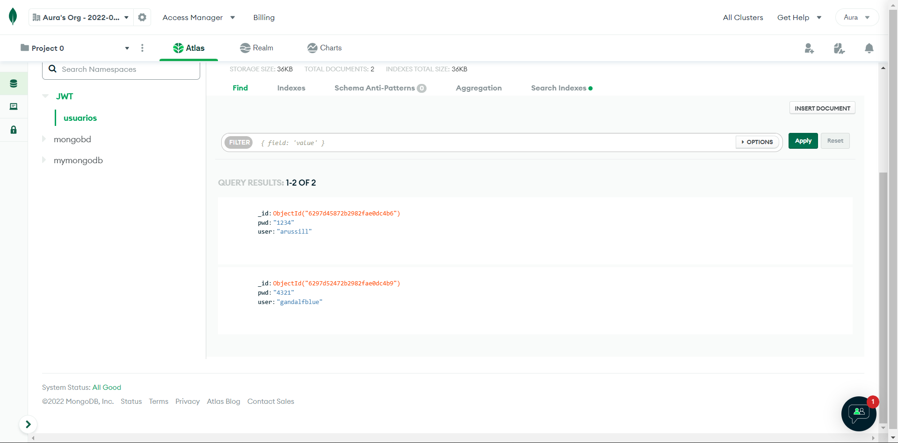

# Practica JWT con Spring Security

## Autores 

    - Andres Lozada

    - Aura Russill

## Se genera el token apartir de la autenticación del usuario con su username y password (arussill)

## Autorización del usuario apartir del token (se le da la bienvenida al sistema)

## Se genera el token apartir de la autenticación del usuario con su username y password(gandalfblue)

## Autorización del usuario apartir del token (se le da la bienvenida al sistema) (Andres)

## Base de datos en Mongo

